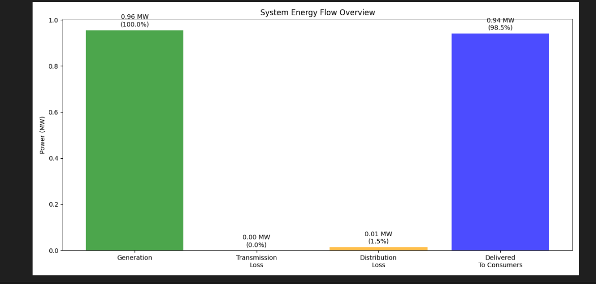
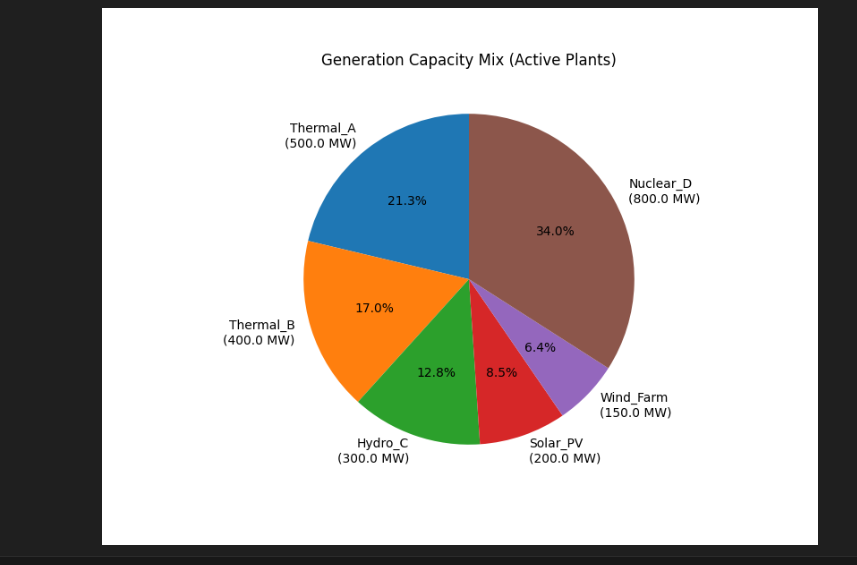
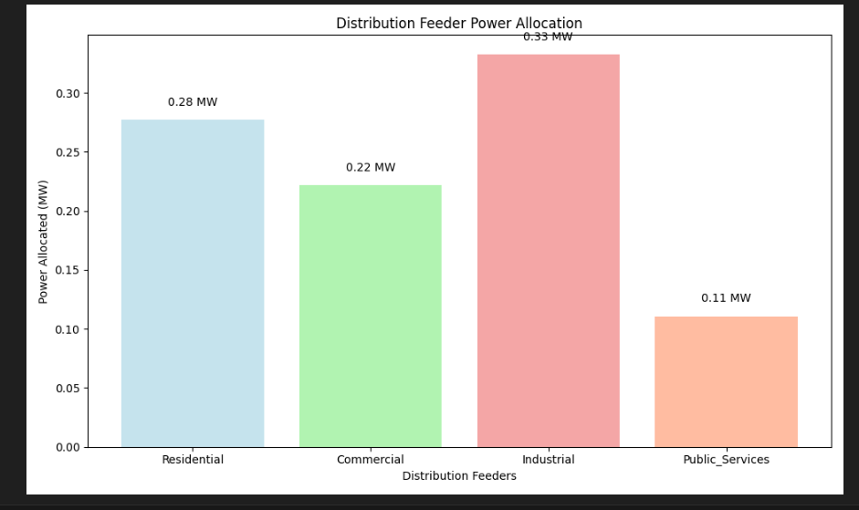
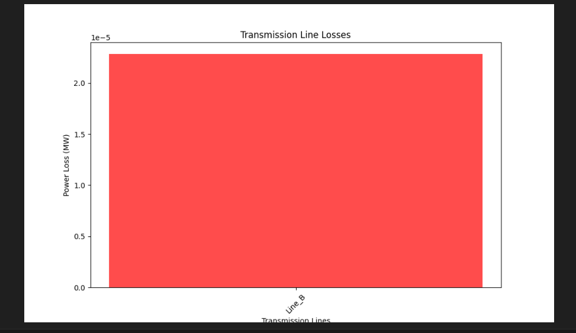

# ⚡ Energy Flow Simulator  
### End-to-End Power System Simulation using Python & Object-Oriented Programming  

---

## 📌 Overview  
The **Energy Flow Simulator** models the complete lifecycle of electrical energy from **generation to utilization**, integrating **Object-Oriented Programming (OOP)** with core **Electrical Engineering concepts** such as losses, efficiency, and demand handling.

---

## ⚙️ System Architecture  
Generation → Transmission → Distribution → Utilization  

---

## 🔧 Key Features  
- Multi-source generation (Thermal, Hydro, Solar, Wind, Nuclear)  
- Transmission loss calculation using **I²R formula**  
- Voltage drop modeling using resistance & reactance  
- Distribution with transformer efficiency & feeder allocation  
- Consumer demand simulation (Domestic, Commercial, Industrial)  
- Merit-order dispatch & automatic load balancing  
- Automated report generation  
- Graphical visualization using Matplotlib  

---

## 🧠 OOP Concepts Applied  
- Abstraction  
- Inheritance  
- Polymorphism  
- Encapsulation  
- Operator Overloading  
- Exception Handling  

---

## 📊 Results  
- System Efficiency ≈ 90%  
- Generation, Transmission & Distribution loss analysis  
- Power flow tracking  
- Demand-supply matching  
- Automated reports  

---

## 📸 Project Outputs  

### 🔹 Energy Flow Overview  

### 🔹 Generation Mix  

### 🔹 Feeder Allocation  

### 🔹 Transmission Loss  

---

## 🖥️ How to Run  
python ENERGY_FLOW_SIMULATOR.py

---

## 👨‍💻 Team Members  
- Navin Rubag V P  
- V R Bhirugudev  
- M S Vignesh  
- Dharshan R S  
